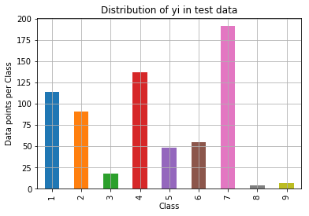

Data: Memorial Sloan Kettering Cancer Center (MSKCC)

Source: https://www.kaggle.com/c/msk-redefining-cancer-treatment

## Problem statement : 
Classify the given genetic variations/mutations based on evidence from text-based clinical literature.

## Real-world/Business objectives and constraints.

No low-latency requirement.
 
Interpretability is important.
 
Errors can be very costly.
 
Probability of a data-point belonging to each class is needed.

### Machine Learning Problem Formulation

We have two data files: one conatins the information about the genetic mutations and the other contains the clinical evidence (text) that human experts/pathologists use to classify the genetic mutations.
Both these data files are have a common column called ID

### Performance Metric

Source: https://www.kaggle.com/c/msk-redefining-cancer-treatment#evaluation

Metric(s):
Multi class log-loss
Confusion matrix

### Data Overview:

training_variants (ID , Gene, Variations, Class)
 
training_text (ID, Text)

  

We split the data randomly into train, CV and test in the ratio 64:20:16 

**Train Distribution**

  

**CV Distribution**

  

**Test Distribution**

  

We can see that the train, test and cv have the same distribution

## Univariate Analysis

1. Gene Feature

Gene is a categorical Feature. We can featurize it using one hot encoding or response coding. There are 229 different categories of genes in the train data, and they are distibuted as follows

  

2. Variation Feature

Variation is a categorical variable. We can featurize it using one hot encoding or response coding. There are 1924 different categories of variations in the train data, and they are distibuted as follows

  

3. Text Feature

We used one hot encoding BoW  and TFIDF to convert words to vectors.

## Machine Learning Models

### 1. Random Model

We check the worst case log loss and compare it with other models

### 2. Naive Bayes

Naive bayes works well with text data and high dimensional data. so we use it as a baseline model. We fit the model on train data, hyperparameter tune on cv data and predict on test data.

### 3. KNN

KNN does not work with high dimensional data but we used it to just try and check the log loss. We get a log loss of 1.10

### 4. Logistic Regression

Logistic Regression works well with high dimensional data and is also interpretable. We used LR with both class balancing and without it and checked the log loss.

### 5. Random forest

- **One hot encoding:** Normally DT works well with low-dimension data.It is also interpretable. By changing the no of base learners and max depth in Random Forest Classifier we found that best base learners=1000 and max depth=10.Then we fitted the model with best hyper-parameters and test data is applied to it and found out that log loss value is 1.17

- **Response coding** By changing the no of base learners and max depth in Random Forest Classifier we found that best base learners=100 and max depth=5.Then we fitted the model with best hyper-parameters and found that train logloss is 0.06,and CV log loss is 1.41 which says that model is overfitted even with best hyper-parameters.So we don’t use RF+Response Coding .

### 6. Stacking Classifier

We stacked three classifiers named LR,SVM,NB and LR as meta classifier.Now we applied the training data to the model and used the CV data for finding best hyper-parameter.With the best hyperparameter we fitted the model and test data is applied to the model and found out the log-loss value is 1.15

We try out TFIDF featurization and more hyperparameter tuning to improve the models.

## Results

  

